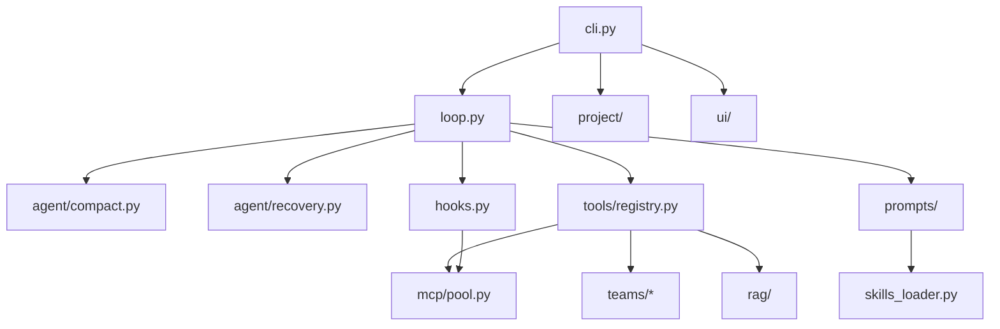

# Architecture

## 来源

- 上游：https://github.com/shareAI-lab/learn-claude-code
- 逻辑基线：`s20_comprehensive/code.py`
- Skills：从上游 `skills/` 复制后按需增补
- 本仓库：https://github.com/1074739572/claude-code_exchange

已做改进清单见 [README.md](README.md)；踩坑与修复细节见 [docs/bugs/](docs/bugs/README.md)。

---

## 设计原则

**机制很多，循环一个。** 所有能力挂在同一个 `agent_loop` 上，与上游 s01–s20 教学一致。

```
用户输入 → hooks → cron/background 注入 → compact → system prompt → LLM
    → tool_use? → PreToolUse → dispatch → PostToolUse → messages → 下一轮
```

Prompt 侧再拆一层：

```
static system（可缓存） + ephemeral user 消息（todos / 时间 / 最新意图等）
```

---

## 模块职责

| 模块 | 对应教学章 | 职责 |
|------|-----------|------|
| `loop.py` | s01 | 主循环、tool_result 回写 |
| `tools/registry.py` | s02 | 工具 schema + handler 分发 |
| `hooks.py` | s03–s04 | 权限与扩展点 |
| `todos/` + `tools/todo.py` | s05 | 会话内 todo（持久化到 `.project/`） |
| `agent/subagent.py` / `agents/` | s06 | 一次性子 Agent / typed 角色 |
| `skills_loader.py` | s07 | 按需技能 |
| `agent/compact.py` | s08 | 分层压缩 |
| `context.py` + `prompts/` | s09–s10 | 记忆 + static/dynamic/ephemeral |
| `agent/recovery.py` | s11 | 错误恢复 |
| `tasks.py` | s12 | 持久化任务图 |
| `agent/background.py` | s13 | 后台 bash |
| `agent/cron.py` | s14 | 定时调度 |
| `teams/*` | s15–s17 | 邮箱、协议、自治队友 |
| `worktree.py` | s18 | 目录隔离 |
| `mcp/*` | s19 | MCP 发现与调用 |
| `providers/` / `rag/` / `project/` / `ui/` | — | 本仓库扩展：多模型、检索、会话、终端 UI |

---

## 数据落盘（相对 cwd）

| 路径 | 内容 |
|------|------|
| `.tasks/` | 活动任务（pending / in_progress） |
| `.tasks/archive/` | 已完成/已取消任务 |
| `.mailboxes/` | 团队消息 JSONL |
| `.worktrees/` | git worktree |
| `.memory/MEMORY.md` | 长期记忆 |
| `.project/` | session.jsonl、todos、state、history |
| `.project/usage/` | 按日 token / 缓存命中流水（`/usage`；`/clear` 不删） |
| `.transcripts/` | compact 前完整备份 |
| `.rag/` | RAG corpus / chunks |
| `.scheduled_tasks.json` | 持久 cron |

---

## 依赖关系（简图）


