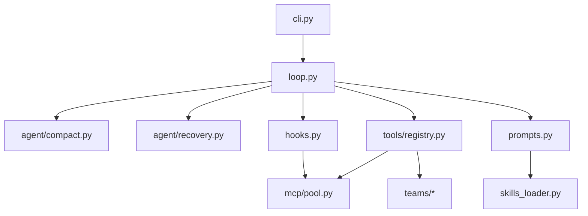

# Architecture & Improvement Plan

## 设计原则

**机制很多，循环一个。** 所有能力挂在同一个 `agent_loop` 上，与 s01–s20 教学一致。

```
用户输入 → hooks → cron/background 注入 → compact → system prompt → LLM
    → tool_use? → PreToolUse → dispatch → PostToolUse → messages → 下一轮
```

## 模块职责

| 模块 | 对应教学章 | 职责 |
|------|-----------|------|
| `loop.py` | s01 | 主循环、tool_result 回写 |
| `tools/registry.py` | s02 | 工具 schema + handler 分发 |
| `hooks.py` | s03–s04 | 权限与扩展点 |
| `tools/todo.py` | s05 | 会话内 todo |
| `agent/subagent.py` | s06 | 一次性子 Agent |
| `skills_loader.py` | s07 | 按需技能 |
| `agent/compact.py` | s08 | 四层压缩 |
| `context.py` + `prompts.py` | s09–s10 | 记忆 + prompt 组装 |
| `agent/recovery.py` | s11 | 错误恢复 |
| `tasks.py` | s12 | 持久化任务图 |
| `agent/background.py` | s13 | 后台 bash |
| `agent/cron.py` | s14 | 定时调度 |
| `teams/*` | s15–s17 | 邮箱、协议、自治队友 |
| `worktree.py` | s18 | 目录隔离 |
| `mcp/*` | s19 | MCP 发现与调用 |

## 数据落盘（相对 cwd）

| 路径 | 内容 |
|------|------|
| `.tasks/` | 任务 JSON |
| `.mailboxes/` | 团队消息 JSONL |
| `.worktrees/` | git worktree |
| `.memory/MEMORY.md` | 长期记忆 |
| `.transcripts/` | 压缩前对话备份 |
| `.scheduled_tasks.json` | 持久 cron |

## 已完成的改进（相对 s20）

1. **包结构拆分**：便于单独测试、替换 MCP/teams 实现  
2. **Skills 自包含**：不依赖仓库根目录 `skills/`  
3. **MCP 双模式**：`RealMCPClient`（stdio）+ `MockMCPClient`（离线）  
4. **MCP 权限元数据**：`mcp_tool_meta` 驱动 destructive 确认  
5. **配置外置**：`config/mcp.json`、`.env.example`

## 待改进（建议顺序）

### Phase 1 — MCP 生产化
- [ ] HTTP/SSE transport
- [ ] 连接断线重连、超时杀子进程
- [ ] 队友继承 Lead 的 MCP 工具池

### Phase 2 — 记忆（s09 完整版）
- [ ] 写入 MEMORY.md 的工具
- [ ] 按任务检索相关记忆片段

### Phase 3 — 可观测性
- [ ] 结构化日志（tool name、latency、token 估算）
- [ ] OpenTelemetry 可选集成

### Phase 4 — 测试
- [ ] `compact` 不拆散 tool_use/tool_result 对
- [ ] task DAG `blockedBy` 解锁
- [ ] MCP mock connect + call

## 依赖关系（简图）



## 来源

- 逻辑基线：`s20_comprehensive/code.py`
- Skills：仓库 `skills/` 目录完整复制
- MCP 协议参考：`skills/mcp-builder/SKILL.md`、s19 README
