# Harness 架构流程图（中文注释版）

```mermaid
flowchart TD
    %% ============ 样式 ============
    classDef entry fill:#1a1a2e,stroke:#e94560,stroke-width:2,color:#fff
    classDef prompt fill:#16213e,stroke:#0f3460,stroke-width:2,color:#fff
    classDef llm fill:#0f3460,stroke:#533483,stroke-width:2,color:#fff
    classDef decision fill:#533483,stroke:#e94560,stroke-width:2,color:#fff,shape:rhombus
    classDef tool fill:#2d6a4f,stroke:#52b788,stroke-width:1,color:#fff
    classDef system fill:#370617,stroke:#e85d04,stroke-width:2,color:#fff
    classDef subagent fill:#3d405b,stroke:#e07a5f,stroke-width:1,color:#fff
    classDef compact fill:#5c4d7d,stroke:#b8a9e8,stroke-width:1,color:#fff
    classDef mcp fill:#1b4332,stroke:#95d5b2,stroke-width:1,color:#fff
    classDef bg fill:#4a4e69,stroke:#c9ada7,stroke-width:1,color:#fff
    classDef project fill:#3e1f47,stroke:#c77dff,stroke-width:1,color:#fff
    classDef cron fill:#5f0f40,stroke:#e5383b,stroke-width:1,color:#fff
    classDef endNode fill:#2b2d42,stroke:#8d99ae,stroke-width:2,color:#fff

    %% ============ 入口层 ============
    subgraph TOP["🚪 入口 & 模式选择"]
        CLI["cli.py main()\n命令行入口 → 启动 harness"]:::entry
        MODE["modes/runtime.py get_mode()\n读取当前执行模式"]:::entry
        MODES_CONFIG["config/modes.json\n模式定义文件\n每种模式有独立的 prompt 指令"]:::system
        DIRECT_MODE["Mode: Direct（直打）\n当前模型自己干活，不派子 agent"]:::entry
        PLAN_MODE["Mode: Plan（规划）\n先做规划，再执行"]:::entry
        AUTO_MODE["Mode: Auto（自动）\n自动判断什么时候该派子 agent"]:::entry
    end

    %% ============ 主循环 ============
    subgraph LOOP["🔄 主循环（loop.py）"]
        LOOP_START["main_loop()\nwhile True 无限循环\n（每次迭代 = 1 轮 LLM 调用）"]:::system
        
        CHECK_CANCEL{"是否被取消？\nis_cancelled()"}:::decision
        CHECK_COMPACT{"上下文快满了？\n或 PromptTooLongError？"}:::decision
        AUTO_COMPACT["自动压缩历史\nauto_compact / reactive_compact"]:::compact
        CHECK_CRON["消费定时任务队列\nconsume_cron_queue()"]:::cron
        
        PROMPT_ASSEMBLY["拼接系统提示词\nassemble_system_prompt()\n= 固定部分 + 动态部分"]:::prompt
        STATIC_PROMPT["固定部分（缓存友好）：\n- 身份 identity\n- 边界 grounding\n- 工具列表 tools\n- 工作目录 workspace\n- 技能目录 skills"]:::prompt
        DYNAMIC_CONTEXT["动态部分：\n- 当前模式指令\n- 会话上下文\n- project 状态"]:::prompt
        EPHEMERAL["短暂用户消息：\ntodo_write 后清空\nephemeral cache"]:::prompt
        
        LLM_CALL["调用大模型\nclaude.llm.create()\n发送 messages → 拿到回复"]:::llm
        
        CHECK_MAX_STEPS{"达到最大轮数？\nmax_steps reached？"}:::decision
        FINALIZE["_finish()\n保存状态 → 退出"]:::endNode
        
        CANCEL_HANDLE["finalize_cancelled_tool_round()\n取消本轮，记录现场"]:::endNode
        
        TOOL_LOOP{"处理回复里的\n所有 tool_use 块\n遍历 response.content"}:::decision
    end

    %% ============ 工具调度 ============
    subgraph TOOLS["🔧 工具处理流水线"]
        TOOL_NAME["解析 tool_use 块\n提取工具名 + 参数"]:::tool
        
        SUBAGENT_CHECK{"是子 agent 工具？\nrun_agent_task 或 spawn_subagent？"}:::decision
        SUBAGENT_TASK["subagent.py\nrun_agent_task()\n== 派一个一次性任务 =="]:::subagent
        SUBAGENT_SPAWN["subagent.py\nspawn_subagent()\n== 创建一个长期子 agent =="]:::subagent
        
        TODO_CHECK{"是 todo_write 工具？"}:::decision
        TODO_RESET["重置 ephemeral cache\n清空临时消息缓冲"]:::tool
        
        MCP_CHECK{"工具名以 mcp__ 开头？\n表示外部 MCP 服务器工具"}:::decision
        MCP_DISPATCH["mcp/pool.py\n按 mcp__{服务器}__{工具名}\n分发到对应 MCP 服务器"]:::mcp
        
        BACKGROUND_CHECK{"需要后台执行？\nshould_run_background？\n（慢 bash 命令检测）"}:::decision
        BACKGROUND_START["background.py\nstart_background_task()\n→ 启动后台线程执行"]:::bg
        
        NORMAL_TOOL["普通内置工具\nhandlers.get(name)\n→ call_tool_handler()"]:::tool
        
        HOOKS["触发钩子\nPostToolUse\n（插件扩展点）"]:::system
        RENDER["控制台输出\n渲染工具结果"]:::system
        GUARDS["记录审计信息：\n- lookup_guard（查重）\n- writing_guard（写操作）\n- mutations（变更追踪）"]:::system
        
        BUILD_RESULTS["打包工具结果\nbuild_user_content(results)\n+ collect_background_results()"]:::bg
        APPEND_MSGS["将结果追加到 messages\nrole = user"]:::system
    end

    %% ============ 内置工具详情 ============
    subgraph HANDLERS["📋 内置工具清单"]
        TOOLS_REG["tools/registry.py\nassemble_all_tools()\n组装所有工具的 schema 和 handler"]:::tool
        
        FILE_TOOLS["📄 文件操作\nread_file / write_file\nedit_file / glob"]:::tool
        BASH_TOOL["💻 Shell 命令\nbash 执行"]:::tool
        TASK_TOOLS["✅ 任务管理\ntodo_write / create_task\nlist_tasks / claim_task\ncomplete_task / clear_tasks"]:::tool
        AGENT_TOOLS["🤖 子 agent 管理\nspawn_teammate / send_message\ncheck_inbox / request_shutdown\nrequest_plan / review_plan"]:::tool
        MISC_TOOLS["🔧 杂项\nload_skill（加载技能）\ncompact（压缩上下文）"]:::tool
        WORKTREE_TOOLS["🌲 Git 工作树\ncreate_worktree / remove_worktree\nkeep_worktree"]:::tool
        RAG_TOOLS["📚 RAG 检索\nrag_index / rag_search / rag_status"]:::tool
        PROJECT_TOOLS["📖 论文改写项目\nproject_init / project_set_chapter\nproject_note / project_status\nproject_reset"]:::project
        
        MCP_CONNECT["🌐 MCP 外部工具\nconnect_mcp 连接服务器\n支持 mock（模拟）和 real（真实）"]:::mcp
    end

    %% ============ 子 agent 系统 ============
    subgraph SUBAGENT_SYS["🧠 子 Agent 系统（agents/）"]
        AGENT_REGISTRY["agents/registry.py\nAgentProfile 定义\n每个子 agent 有：\n- 绑定的模型\n- 独立的 system prompt"]:::subagent
        AGENT_SCHEMA["agents/schema.py\n动态生成工具 schema\n只暴露给子 agent 的工具"]:::subagent
        RUNNER["agents/runner.py\n核心调度器"]:::subagent
        RUNNER_FLOW["子 agent 执行流程：\n1. 准备隔离的 messages\n2. 调用绑定模型\n3. 处理工具的返回\n4. 反复直到任务完成\n5. 返回结果给父 agent"]:::subagent
    end

    %% ============ 压缩系统 ============
    subgraph COMPACT_SYS["📦 上下文压缩系统（agent/compact/）"]
        COMPACT_PIPELINE["pipeline.py\n压缩入口：\nprepare_context()\ncompact_history()\nreactive_compact()"]:::compact
        LAYERS["layers.py 压缩策略：\n- keep_tail（保留最近 N 条）\n- micro_compact（删掉完整消息块）\n- snip_compact（截断长字段）\n- tool_result_budget（控制结果大小）"]:::compact
        SIZING["sizing.py\nestimate_size()\n估算 token 数量"]:::compact
        SUMMARIZE["summarize.py\nsummarize_history()\n让 LLM 自己总结旧历史"]:::compact
        FOCUS["messages.py\nensure_latest_user_focus()\n确保最新用户意图保留"]:::compact
    end

    %% ============ MCP 系统 ============
    subgraph MCP_SYS["🔌 MCP 外部服务器系统"]
        MCP_CONFIG["mcp/config.py\nload_mcp_config()\n从 config/mcp.json 读取"]:::mcp
        MCP_CLIENT["mcp/client.py\ncreate_real_client()\n创建真实的 MCP 客户端"]:::mcp
        MCP_BASE["mcp/base.py\nMCPClientProtocol 接口\nMockMCPClient 模拟客户端"]:::mcp
        MCP_MOCK["mcp/mock.py\n内置模拟服务器\ndocs（文档）、deploy（部署）"]:::mcp
        MCP_POOL["mcp/pool.py\ntool 池管理：\nassemble_tool_pool()\nconnect / disconnect\n工具名规范化（去特殊字符）"]:::mcp
    end

    %% ============ 后台执行 ============
    subgraph BG_SYS["⏳ 后台执行系统"]
        BG_DETECT["慢操作检测\nis_slow_operation()\n关键词：install / build\ntest / deploy / compile..."]:::bg
        BG_THREAD["→ 启动 daemon 线程\n不影响主循环继续"]:::bg
        BG_COLLECT["收集结果\ncollect_background_results()\n→ 包装成 XML\n<task_notification>"]:::bg
        BG_INJECT["注入到用户消息\ninject_background_notifications()"]:::bg
    end

    %% ============ 定时任务 ============
    subgraph CRON_SYS["⏰ 定时任务系统"]
        CRON_SCHEDULE["schedule_cron()\n注册定时任务"]:::cron
        CRON_LIST["list_crons()\n查看已注册任务"]:::cron
        CRON_CANCEL["cancel_cron()\n取消定时任务"]:::cron
        CRON_QUEUE["consume_cron_queue()\n每次主循环检查\n到点就触发"]:::cron
    end

    %% ============ 论文项目系统 ============
    subgraph PROJ_SYS["📑 论文/报告改写项目"]
        PROJ_STATE["project/state.py\n\U0001F4CB 项目状态：\nChapter（章节）\nProjectState（总体）\ninit_state / save_state"]:::project
        PROJ_SESSION["project/session.py\n\U0001F4BE 会话管理：\nserialize_messages\nload_history / clear_history"]:::project
        PROJ_SESSION_STORE["project/session_store.py\n会话 ID 和路径管理"]:::project
        PROJ_TRANSCRIPT["project/transcript.py\n导入/列出历史记录"]:::project
    end

    %% ============ 连接线 ============
    CLI --> MODE
    MODE --> MODES_CONFIG
    MODES_CONFIG --> DIRECT_MODE
    MODES_CONFIG --> PLAN_MODE
    MODES_CONFIG --> AUTO_MODE
    DIRECT_MODE --> LOOP_START
    PLAN_MODE --> LOOP_START
    AUTO_MODE --> LOOP_START

    LOOP_START --> CHECK_CANCEL
    CHECK_CANCEL -->|"✅ 取消"| CANCEL_HANDLE
    CANCEL_HANDLE --> FINALIZE
    CHECK_CANCEL -->|"❌ 不取消"| CHECK_COMPACT
    CHECK_COMPACT -->|"✅ 需要压缩"| AUTO_COMPACT
    CHECK_COMPACT -->|"❌ 不需要"| CHECK_CRON
    AUTO_COMPACT --> CHECK_CRON

    CHECK_CRON --> PROMPT_ASSEMBLY

    PROMPT_ASSEMBLY --> STATIC_PROMPT
    PROMPT_ASSEMBLY --> DYNAMIC_CONTEXT
    PROMPT_ASSEMBLY --> EPHEMERAL
    STATIC_PROMPT --> LLM_CALL
    DYNAMIC_CONTEXT --> LLM_CALL
    EPHEMERAL --> LLM_CALL

    LLM_CALL --> CHECK_MAX_STEPS
    CHECK_MAX_STEPS -->|"✅ 已达上限"| FINALIZE
    CHECK_MAX_STEPS -->|"❌ 继续"| TOOL_LOOP

    TOOL_LOOP -->|"⏭️ 无工具调用"| LOOP_START
    TOOL_LOOP -->|"🔍 处理每个 tool_use"| TOOL_NAME

    TOOL_NAME --> SUBAGENT_CHECK
    SUBAGENT_CHECK -->|"✅ 是子 agent"| SUBAGENT_SYS
    SUBAGENT_CHECK -->|"❌ 不是"| TODO_CHECK

    TODO_CHECK -->|"✅ 是 todo_write"| TODO_RESET
    TODO_CHECK -->|"❌ 不是"| MCP_CHECK

    MCP_CHECK -->|"✅ 是 MCP 工具"| MCP_DISPATCH
    MCP_CHECK -->|"❌ 不是"| BACKGROUND_CHECK

    BACKGROUND_CHECK -->|"✅ 需要后台"| BACKGROUND_START
    BACKGROUND_CHECK -->|"❌ 直接执行"| NORMAL_TOOL

    BACKGROUND_START --> RENDER
    NORMAL_TOOL --> HOOKS
    MCP_DISPATCH --> HOOKS
    TODO_RESET --> HOOKS
    SUBAGENT_TASK --> HOOKS
    SUBAGENT_SPAWN --> HOOKS

    HOOKS --> RENDER
    RENDER --> GUARDS
    GUARDS --> BUILD_RESULTS
    BUILD_RESULTS --> APPEND_MSGS
    APPEND_MSGS --> LOOP_START

    %% 工具列表 → 具体工具
    NORMAL_TOOL -.-> TOOLS_REG
    TOOLS_REG -.-> FILE_TOOLS
    TOOLS_REG -.-> BASH_TOOL
    TOOLS_REG -.-> TASK_TOOLS
    TOOLS_REG -.-> AGENT_TOOLS
    TOOLS_REG -.-> MISC_TOOLS
    TOOLS_REG -.-> WORKTREE_TOOLS
    TOOLS_REG -.-> RAG_TOOLS
    TOOLS_REG -.-> PROJECT_TOOLS
    TOOLS_REG -.-> MCP_CONNECT

    %% 子 agent 细节
    SUBAGENT_TASK -.-> RUNNER
    SUBAGENT_SPAWN -.-> RUNNER
    RUNNER -.-> AGENT_REGISTRY
    RUNNER -.-> AGENT_SCHEMA
    RUNNER -.-> RUNNER_FLOW

    %% 后台执行细节
    BACKGROUND_CHECK -.-> BG_DETECT
    BACKGROUND_START -.-> BG_THREAD
    BG_THREAD -.-> BG_COLLECT
    BUILD_RESULTS -.-> BG_COLLECT
    APPEND_MSGS -.-> BG_INJECT

    %% 压缩细节
    AUTO_COMPACT -.-> COMPACT_PIPELINE
    COMPACT_PIPELINE -.-> LAYERS
    COMPACT_PIPELINE -.-> SIZING
    COMPACT_PIPELINE -.-> SUMMARIZE
    COMPACT_PIPELINE -.-> FOCUS

    %% MCP 细节
    MCP_DISPATCH -.-> MCP_POOL
    MCP_POOL -.-> MCP_CONFIG
    MCP_POOL -.-> MCP_CLIENT
    MCP_POOL -.-> MCP_BASE
    MCP_POOL -.-> MCP_MOCK

    %% 定时任务细节
    CHECK_CRON -.-> CRON_QUEUE
    CRON_QUEUE -.-> CRON_SCHEDULE
    CRON_QUEUE -.-> CRON_LIST
    CRON_QUEUE -.-> CRON_CANCEL

    %% 论文项目细节
    PROJECT_TOOLS -.-> PROJ_STATE
    PROJECT_TOOLS -.-> PROJ_SESSION
    PROJECT_TOOLS -.-> PROJ_SESSION_STORE
    PROJECT_TOOLS -.-> PROJ_TRANSCRIPT
```



---

## 📖 架构中文详解（文字版）

### 一句话概括

**这个 Harness 是一个"Agent 运行时框架"** — 它的核心是一个无限循环：每次循环让大模型走一步（想 → 调用工具 → 拿结果 → 再想下一步），直到任务完成。

---

### 1️⃣ 启动入口（CLI）

```
用户通过命令行启动 → cli.py 解析参数
→ 读取 modes.json 选择模式（直打 / 规划 / 自动）
→ 进入 main_loop()
```

**三种模式：**
| 模式 | 含义 |
|------|------|
| **直打（Direct）** | 当前模型自己干活，不派子 agent |
| **规划（Plan）** | 先做规划，再按规划执行 |
| **自动（Auto）** | 自动判断什么时候该派子 agent |

---

### 2️⃣ 主循环（一次迭代 = 1 轮 LLM 调用）

```
每次循环执行以下步骤：
```

| 步骤 | 干什么 | 对应代码 |
|------|--------|----------|
| **① 检查取消** | 是否被用户取消？ | `is_cancelled()` |
| **② 检查压缩** | 上下文快满了？需要压缩历史？ | `auto_compact()` |
| **③ 消费定时任务** | 有到点的 cron 任务？触发它 | `consume_cron_queue()` |
| **④ 拼接提示词** | 组装 system prompt = 固定部分 + 动态部分 | `assemble_system_prompt()` |
| **⑤ 调用大模型** | 发送所有 messages 给 LLM → 拿回复 | `claude.llm.create()` |
| **⑥ 处理工具调用** | 遍历 LLM 回复里的 tool_use 块 | 见下面"工具调度" |
| **⑦ 打包结果** | 把工具执行结果装进 messages | `build_user_content()` |
| **⑧ 回到 ①** | 继续下一轮 | while True |

**固定提示词** 包括：身份（你是谁）、边界规则（怎么做）、工具列表、工作目录、技能目录。
**动态提示词** 包括：当前模式指令、会话上下文、项目状态。

---

### 3️⃣ 工具调度（核心）

LLM 回复里可能有多个 `tool_use` 块，主循环逐个处理：

```
提取工具名和参数
↓
判断类型：
  ├─ 是 run_agent_task / spawn_subagent？ → 派子 agent
  ├─ 是 todo_write？ → 更新任务列表，清空缓存
  ├─ 是 mcp__xxx？ → 转发到 MCP 外部服务器
  ├─ 是慢 bash 命令？ → 后台线程执行
  └─ 其他普通工具 → 直接执行 handler
↓
触发钩子（PostToolUse）→ 控制台输出 → 记录审计
↓
打包结果 → 追加到 messages → 继续下一轮
```

**常见的内置工具：**

| 类别 | 工具举例 |
|------|----------|
| 📄 文件 | read_file, write_file, edit_file, glob |
| 💻 命令 | bash |
| ✅ 任务 | todo_write, create_task, list_tasks |
| 🤖 子 agent | spawn_teammate, send_message, request_plan |
| 🌲 Git | create_worktree, remove_worktree |
| 📚 RAG | rag_index, rag_search, rag_status |
| 📖 论文 | project_init, project_set_chapter, project_note |

---

### 4️⃣ 子 Agent 系统

```
run_agent_task() / spawn_subagent()
  ↓
创建 AgentProfile（绑定哪个模型、用啥提示词）
  ↓
生成工具 schema（只给子 agent 能用的工具）
  ↓
启动隔离的子循环：
  1. 准备 messages（父 agent 传来的上下文）
  2. 调用子 agent 的模型
  3. 执行子 agent 的工具
  4. 反复直到完成
  5. 把结果返回给父 agent
```

---

### 5️⃣ 上下文压缩（防爆）

当对话太长（接近 token 上限）时自动触发：

| 策略 | 干什么 |
|------|--------|
| **keep_tail** | 只保留最近 N 条消息 |
| **micro_compact** | 删掉完整的大段消息块 |
| **snip_compact** | 截断超长的字段值 |
| **tool_result_budget** | 控制工具返回结果的大小 |
| **summarize** | 让 LLM 自己总结旧的历史 |

---

### 6️⃣ MCP 外部工具

MCP = Model Context Protocol，一种让 Agent 调用外部服务器的标准协议。

```
config/mcp.json 里配置服务器
  ↓
启动时连接所有 MCP 服务器
  ↓
工具名格式：mcp__{服务器名}__{工具名}
  ↓
调用时按名分发到对应服务器
```

支持 mock（模拟）和 real（真实）两种模式。

---

### 7️⃣ 后台执行（慢操作不阻塞）

```
用户执行 bash（如 pip install、npm build）
  ↓
检测到关键词（install / build / test / deploy）
  ↓
→ 启动 daemon 线程在后台跑
→ 主循环继续执行不被卡住
  ↓
下一轮循环时收集后台结果
  ↓
包装成 <task_notification> XML 注入给 LLM
```

---

### 8️⃣ 论文/报告改写系统

这是一个**专门针对长文档改写**的功能：

- `project_init`：初始化项目（标题、源文档路径）
- `project_status`：查看当前进度（已写/待写章节）
- `project_set_chapter`：标记某个章节为进行中/已完成
- `project_note`：保存笔记
- `project_reset`：重置会话（保留章节进度）

底层用 RAG 检索参考文档，配合分章节管理来写长报告。

---

### 9️⃣ 定时任务

```
schedule_cron("0 */2 * * *", "每两小时提醒")
  ↓
注册到 cron 系统
  ↓
主循环每次迭代都会检查队列
  ↓
到点就自动触发 → 注入 prompt
```
