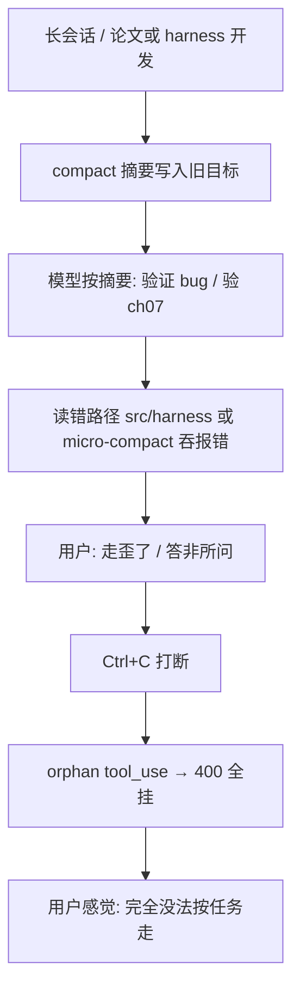

# 001 — Agent 偏移（任务表 · 话题 · 会话状态）

**状态：** A 已修复；B 部分缓解（含 004 compact）；C 大部分已修复（micro 落盘见 004）  
**影响：** 通用 agent 与论文/RAG 长任务；用户看到「活干了表不对」「问 A 答 B」「打断后全挂」  
**关联：** [002 缓存](./002-prompt-cache-vs-dynamic-context.md) · [003 Resume](./003-resume-opt-in.md) · [004 压缩](./004-context-compaction.md)

---

## 总览：偏移不是一件事

用户说的「偏移」在 harness 里至少有三类，**机制不同，修法也不同**。混谈会导致「修了 todo 仍在打转」。

| 类型 | 用户看到什么 | 主因 | 修复状态 |
|------|--------------|------|----------|
| **A. 任务表偏移** | `todo_write` 与真实步骤对不上 | 提醒无全表、未注入 todos、计数按 tool 不按 LLM 回合 | **v1 已修复** |
| **B. 话题/目标偏移** | 问 meta/写方案，却验 ch07、跑 harness 测试 | compact/resume 摘要压过「本条用户话」 | **部分缓解**（focus + 004 模板/tail） |
| **C. 会话/工具链偏移** | Ctrl+C 后 400、模型读不存在的路径 | 打断留 orphan `tool_use`、摘要误导路径 | **大部分已修复**（C3 micro 见 004） |

下面分节展开；**A 节**保留原 todo 专项结论，**B/C 节**为 2026-07 真实会话归纳。

---

## 类型 A — 任务表（`todo_write`）与真实进度偏移

### 现象

1. Agent 已 `todo_write`，也在读/写/跑命令，但终端 **Tasks** 与内心「做到哪了」不一致。
2. 「每 3 轮提醒」存在，但状态仍歪：漏标 `completed`、多项 `in_progress`、做完未入表。

典型原话：

> 不用打印章节表，我要通用 agent，打印任务表，保证任务不歪。每 3 轮带任务，怎么任务实现了状态却不一样？

### 与章节进度表的混淆

另有 **`.project/state.json` 八章进度**（论文专用），Welcome 里 `N/8 done`：

- 启动时读一次，执行中不重画。
- 更新靠 `project_set_chapter` 或 `write_file` → `output/` hook。

用户要的「不歪」指 **通用 `todo_write`**，不是章节表。双轨并存时更易误判。

### 根因（4+1 结构性问题）

| # | 问题 | 后果 |
|---|------|------|
| 1 | 提醒只有 `Update your todos`，**不带当前全表** | 模型凭记忆改表，漏标/臆造 |
| 2 | 修复前 todos **不进**每轮可见上下文 | 看不到 harness「唯一真相」 |
| 3 | `rounds_since_todo` 按 **tool 次数** 而非 **LLM 回合** | 提醒节奏错乱 |
| 4 | schema 过短、无 `activeForm`、无 Rich checklist | 约束弱、用户以为没更新 |
| 5 | 论文场景只动 `output/` 不调 `todo_write` | 章节表与 todo 分叉 |

### 已实施改进（v1）

整条链路：`harness/todos/` → tool 返回全表 → ephemeral/session 注入 → reminder 带全表 → Rich **Tasks** 面板 → **`sessions/<id>/todos.json`**（跟会话，不再用扁平 `.project/todos.json`）。


| 维度 | 修复后 |
|------|--------|
| 模型可见 todos | `build_session_context()` + ephemeral `<session-context>`（见 002） |
| 3 轮提醒 | `format_todo_reminder()` 含**完整列表** + `Rounds since last todo_write: N` |
| 计数 | 每 LLM 回合无 `todo_write` → `note_llm_round_without_todo_update()` |
| UI | `renderer.todo_checklist()`；Welcome **Tasks** 行 |
| 纪律 | `schema.py` 长描述；仅 1 个 `in_progress` |

**关键锚点：**

- `harness/todos/` — state / format / schema  
- `harness/loop.py` — reminder、LLM 回合计数  
- `harness/prompts/dynamic.py` — todos 进 session context  
- `harness/tools/todo.py` — 全表返回 + checklist  

### A 类遗留

| 项 | 说明 |
|----|------|
| Welcome Tasks 行 | 主要在启动时渲染；执行中靠 `todo_write` 时刷面板 |
| 模型仍可能不调 `todo_write` | 靠 schema + reminder 减轻，无法 100% 强制 |
| compact 摘要 | 可能丢细粒度对话进度；todos 靠 `todos.json` 部分独立 |

---

## 类型 B — 话题/目标偏移（答非所问）

### 现象

- 用户问：「为什么偏移 / 写实施方案 / 解释原因」  
- Agent 做：验 `output/ch07` 完整性、跑 `src/harness/todos`、执行 compact 摘要里的「验证 bug 001/002」  
- 用户：「完全走歪了、答非所问、一直在改文件却不总结」

### 根因

#### B1. `[Compacted]` 摘要 = 假「当前任务」

`prepare_context()` 超限时 `compact_history()` 用模型生成摘要，**替换**整段 history 为一条 `[Compacted]` user 消息。

摘要里若写：

> 当前目标：验证 bug 001/002 接线、跑 cache 实验…

则**下一轮即使用户没再下指令**，模型也会按摘要执行——即使用户本条说的是「写 CWRF 风格实施方案」。

**典型过期摘要问题：** 摘要写「ch07 在 7.1.4 截断」，磁盘上 ch07 已完整 → 模型仍进入「验文件/补写」循环。

#### B2. 论文 Resume 注入

启动时 `resume_context_message()` 注入：

```text
[Session resumed] … Continue with chapter X … load_skill(thesis-writing) …
```

system 亦有 `Thesis rewrite: load_skill(thesis-writing)…`。

默认心态变成 **续写 8 章技术报告**，不是 **响应本条 CLI 输入**。

#### B3. 「偏移」一词被误读

用户说「偏移」常指 **任务表/话题跑偏**；长论文会话里模型更易理解成 **文件截断 / read_file offset**，于是法医式验文件而非回答 meta 问题。

#### B4. Prompt 气质 vs 任务类型

- system：`Act, don't explain`  
- `thesis-writing` skill：`rag_search` → `write_file` → 自检  

**写文件循环**被奖励；**解释根因**无明确模式 → 用户问 why 时仍去 `read_file` / `edit_file`。

#### B5. todo 救不了话题偏移

001 v1 保证 **表与步骤对齐**，不保证 **「只答最后一句用户话」**。若 todo 仍是上一轮「检查全部章节」，会继续偏。

### 已缓解（2026-07）

| 措施 | 位置 | 作用 |
|------|------|------|
| `latest_user_query` 进 ephemeral | `cli.py` 写入 context；`dynamic.py` 注入 | 强调「只答本条」+ 正确路径 `harness/` |
| compact 留 tail + 六段摘要 | [004](./004-context-compaction.md) | 压缩后仍带近期对话与 Constraints / Do NOT Forget |
| **最新 user 覆盖摘要** | [004](./004-context-compaction.md) | compact/reactive 末尾强制 `[Current user request]`，显式 overrides 摘要旧目标 |
| micro 落盘可恢复 | [004](./004-context-compaction.md) | 旧 tool 结果可 `read_file`，少路径幻觉 |
| 用户操作 | `/clear`、首条写清「不要继续 compact 任务」 | 立刻有效 |

### B 类仍观察（有痛点再商量）

| 项 | 说明 |
|----|------|
| 解释模式 | 问「为什么/偏移」时仍可能去改文件 |
| 双轨进度 | 论文 `state.json` 与通用 `todo_write` 并存，易误判 |

---

## 类型 C — 会话/工具链偏移（打断、路径、命令）

### 现象

- Esc/Ctrl+C 后：`Interrupted — …` 但下一条 user 触发 **400**：`tool_use` without `tool_result`  
- 模型读 `src/harness/todos/…`（不存在）；真实代码在 **`harness/todos/`**  
- 输入 `/model` 却弹出 **Select mode**  
- LLM 报 `NameError: WORKDIR is not defined`，随后 CLI `UnboundLocalError: checkpoint_history`

### 根因与修复

| # | 问题 | 机制 | 状态 |
|---|------|------|------|
| C1 | **打断留 orphan `tool_use`** | `agent_loop` 在 tool 执行中 `cancel` 返回，assistant 已 append 但无 tool_result | **已修复** — `finalize_cancelled_tool_round()` + `repair_tool_pairing()` |
| C2 | **`turn_start` 在 compact 后失效** | `messages[:]` 被替换后索引错位，`abort_inflight_turn` 删不干净 | **已修复** — `resolve_turn_start()` + 回滚整轮 |
| C3 | **micro-compact 吞 tool 报错** | 旧 tool_result 变成占位符，看不到「文件不存在」 | **已缓解（004）** — `persist_recallable_output` 落盘 + preview；极端长会话仍可能漏看错误 |
| C4 | **`/model` 被 `/mode` 前缀匹配** | `"/model".startswith("/mode")` 为真 | **已修复** — `_match_cli_command()` |
| C5 | **路径幻觉 `src/harness/`** | compact 摘要/模型臆造；与仓库布局不符 | **部分缓解** — focus 注入 + compact 模板 |
| C6 | **`WORKDIR` 未 import** | `dynamic.py` / `compact.py` 引用未导入 | **已修复** |
| C7 | **`checkpoint_history` 局部 import** | Python 将函数内 import 视为局部变量 → UnboundLocalError | **已修复** — 仅模块顶 import |

**关键锚点：**

- `harness/messages/repair.py` — 配对修复、打断收尾  
- `harness/loop.py` — 每轮 LLM 前 `repair_tool_pairing()`  
- `harness/project/session_undo.py` — `abort_inflight_turn` / `resolve_turn_start`  
- `harness/cli.py` — 启动 repair、`_match_cli_command`  
- `scripts/repair_session.py` — 手动修复损坏 session  

### C 类仍观察

| 项 | 说明 |
|----|------|
| micro 预览截断 | 落盘后上下文只有 preview；关键错误仍可能要 `read_file` 全文 |
| LLM HTTP 打断 | 协作式 cancel，需等当前请求结束 |
| `/model` vs provider key | 切模型仍依赖对应 `.env` key |

---

## 因果链（真实会话复盘）

一次「完全走歪」往往是 **B + C 叠加**，而非单一 todo bug：



**todo 偏移（A）** 可能在链上同时存在，但 **即使用户不用 todo，B+C 仍会导致答非所问**。

---

## 用户侧：立刻可用的防偏移清单

| 场景 | 做法 |
|------|------|
| 新话题 / 与摘要无关 | `/clear` 或首句「忽略 compact，本条唯一任务：…」 |
| 只要解释不要改文件 | 写明「禁止 write_file/edit_file，只解释原因」 |
| 写实施方案 vs 8 章报告 | 不用旧 `state.json` 章节；`todo_write` 列本节步骤 |
| 跑偏已发生 | Esc/Ctrl+C → 问题回输入框；仍乱则 `/undo` 或 `/clear` |
| session 400 | 重启 harness（自动 repair）；或 `python scripts/repair_session.py` |
| 选模型 | `/model`（不是 `/mode`） |

---

## 推荐 Agent 首条 prompt 模板（长文档）

```text
load_skill(thesis-writing)
todo_write：先列 3–5 步，仅 1 个 in_progress。

任务：（一句话）
仿写模板：（样例 docx 路径）
内容来源：（终稿 docx 路径）
约束：files/指标与交付要求.md（如有）

规则：
- 用 rag_search，不要 read 整份 docx
- 不要继续 [Compacted] 或 resume 里的旧目标
- 代码包路径是 harness/，不是 src/harness/
- 先输出目录/映射表，等我确认再写正文
```

---

## 相关文件（全类偏移）

```
docs/bugs/README.md             # 总览与候选下一步
docs/bugs/001-todo-drift.md     # 本文
docs/bugs/002-…                 # 缓存 vs 动态上下文
docs/bugs/003-…                 # Resume OpenCode
docs/bugs/004-…                 # compact 保真

harness/todos/                  # A 类
harness/prompts/dynamic.py      # A/B：todos + latest_user_query
harness/prompts/ephemeral.py    # A/B：session-context 注入策略
harness/agent/compact.py        # B/C：摘要 / tail / persist（004）
harness/project/resume.py       # B：thesis resume（003 opt-in）
harness/messages/repair.py      # C：tool 配对 / 打断
harness/project/session_undo.py # C：回滚
harness/cli.py                  # B/C：focus、repair、/model 路由
harness/ui/interrupt_listener.py
skills/thesis-writing/SKILL.md
.project/sessions/<id>/todos.json   # 会话级 todos（A）
.project/state.json                 # 论文章节（B，与 todo 双轨）
```

---

## 验证方式

**A 类（todo）：**

1. `todo_write` 后终端 **Tasks** 面板更新。  
2. 3 LLM 回合无 `todo_write` → reminder 含**完整列表**。  
3. 两个 `in_progress` → tool 返回 Error。

**B 类（话题）：**

1. `/clear` 后首条任务不应自动跑 compact 摘要里的「验证 bug」。  
2. ephemeral / session context 含 `Latest user request` 与 `harness/` 路径提示。

**C 类（会话）：**

1. 运行中 Ctrl+C → 无 400；可继续对话。  
2. `/model` 打开 **Select model**；`/mode` 打开 **Select mode**。  
3. `build_session_context({"latest_user_query":"x"})` 不抛 `WORKDIR` 错误（见 `tests/test_dynamic_prompt.py`）。

---

## 时间线

| 阶段 | 内容 |
|------|------|
| 2026-07 初 | 001 v1：todo 整条链路 |
| 2026-07 中 | 002 缓存分层；B/C 扩写 + repair/focus |
| 2026-07 末 | 003 OpenCode resume；004 compact Phase 1（缓解 B/C3） |
| 2026-07 续 | 004：compact 末尾强制最新 user，摘要旧目标不得压过本条 |
| 仍观察 | 解释模式；snip/预热压缩 — 见 [bugs README](./README.md) |

---

## 与 002 / 003 / 004 的关系

| 文档 | 管什么 | 和 001 的交界 |
|------|--------|----------------|
| **002** | 动态字段放哪、缓存命中 | todos 进 ephemeral，防偏移与省钱可兼得 |
| **003** | 启动是否灌旧项目 | 从源头少一类 B 类「续写论文」偏移 |
| **004** | 压上下文时丢不丢约束 | 缓解 B（摘要/tail/**最新 user 置顶**）与 C3（micro 落盘） |

todos 与时间戳等动态字段已从 static system 挪到 ephemeral（002），**减轻 A 类与缓存冲突**；B 类「摘要目标错误」靠 004 的 focus 消息 + `latest_user_query` 双重约束。
