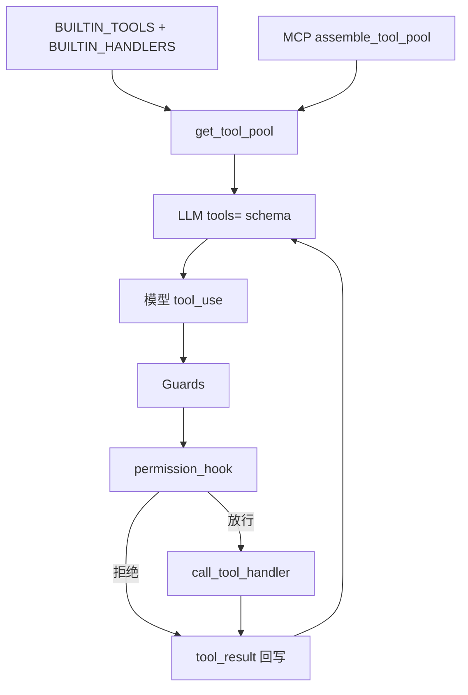

# 工具系统（注册 · 调用 · 权限 · 护栏）

本文档分两块：

1. **流程** — 当前代码里工具是怎么进模型、怎么执行的  
2. **我们相对原版 / 教学 s20 的改动** — 护栏、权限、UI、模式过滤等  

上游基线：`learn-claude-code/s20_comprehensive`；本包入口：`harness/loop.py`。

---

## 一、流程

### 1.1 总览

```text
用户发话
  → agent_loop（harness/loop.py）
  → get_tool_pool()                 # 本轮可用：schema 列表 + name→handler
  → call_llm(..., tools=schema)     # function calling
  → 模型返回 [text?, tool_use, …]
  → 每个 tool_use：
        Guards（行为）
        → PreToolUse hooks（权限）
        → call_tool_handler(...)
        → PostToolUse hooks
        → tool_result 写回 messages
  → 下一轮 LLM，直到无 tool_use → 终答打印
```



### 1.2 注册（有什么工具）

核心文件：[harness/tools/registry.py](../harness/tools/registry.py)

| 结构 | 含义 |
|------|------|
| `BUILTIN_TOOLS` | 给 API 的 JSON：**name / description / input_schema** |
| `BUILTIN_HANDLERS` | **name → Python 函数**（如 `bash` → `run_bash`） |

两边名字必须对齐。例如 schema 有 `read_file`，handlers 里就要有 `"read_file": run_read`。

每轮循环：

```python
tools, handlers = get_tool_pool()
```

`get_tool_pool()` 顺序：

1. 拷贝内置表，按当前 **mode** 去掉 `disable_tools` 里的项  
2. 若 mode 开启 subagent，插入 `task` 工具  
3. `assemble_tool_pool(tools, handlers)` 合并已连接的 **MCP**

MCP（[harness/mcp/pool.py](../harness/mcp/pool.py)）：

- 对外名：`mcp__{server}__{tool}`  
- handler：闭包 → `mcp_client.call_tool(...)`  
- 元数据写入 `mcp_tool_meta`（含 `destructive` / `readOnly`），供权限 hook 使用  

**两路「告诉模型有工具」：**

| 路 | 位置 | 作用 |
|----|------|------|
| API `tools=` | `create_message(..., tools=…)` | **真正能 call** 的 schema |
| system 文字清单 | `PROMPT_SECTIONS["tools"]` | 点名提示，**不是** schema |

没进 `get_tool_pool` 的工具，模型调不了。

### 1.3 调用（怎么执行）

1. 模型在 assistant `content` 里放 `tool_use`（含 `id` / `name` / `input`）  
2. loop 解析每个 block；`text` 只做终端意图 `›`，不代替终答面板  
3. 通过闸门后：`dispatch.call_tool_handler(handler, args, name)`  
   - 实际就是 `handler(**args)`  
   - 异常变成 `"Error: …"` 字符串，loop 不崩  
4. 结果封成 user 侧：

```json
{"type": "tool_result", "tool_use_id": "<与 tool_use.id 配对>", "content": "..."}
```

5. 下一轮 LLM 带着工具结果继续  

特殊：`compact` 不走普通 handler，loop 内直接压缩上下文并 `continue`。

分发：[harness/tools/dispatch.py](../harness/tools/dispatch.py)

### 1.4 权限（允不允许真执行）

主入口：**PreToolUse hook** → `permission_hook`（[harness/hooks.py](../harness/hooks.py)）

```python
register_hook("PreToolUse", permission_hook)
# loop:
blocked = trigger_hooks("PreToolUse", block)
# 返回字符串 → 当作 tool_result，不调用 handler
```

| 工具 | 规则 |
|------|------|
| `bash` | `DENY_LIST` 硬拒；破坏性命令词边界匹配后交互 `Allow?`（可 Esc 取消）；嵌套 `main.py`/`run_cli`/`start cmd` 直接拒绝 |
| `write_file` / `edit_file` | `safe_path()`：必须落在 `WORKDIR` 内，禁止逃逸 |
| `mcp__…` | `mcp_tool_meta[name].destructive` → 交互确认（同上可取消） |
| 其它内置 | 默认放行（另受 Guard / mode 约束） |

路径沙箱：[harness/tools/filesystem.py](../harness/tools/filesystem.py) 的 `safe_path`；读写实现里也会 resolve。

Hook 事件一览：

| 事件 | 时机 | 默认行为 |
|------|------|----------|
| `UserPromptSubmit` | 用户提交 | 静默追加 lookup / writing / goal-stickiness 约束 |
| `PreToolUse` | 执行前 | **权限** +（verbose）日志 |
| `PostToolUse` | 执行后 | 超大输出提示；写文件时更新 project |
| `Stop` | 本轮结束 | （verbose）统计 |

扩展权限：`register_hook("PreToolUse", your_fn)`，返回非 `None` 即拦截。

### 1.5 Guard（行为护栏，不是 ACL）

在 `permission_hook` **之前**，loop 里按序检查（命中则写拒绝型 `tool_result`，本工具不真跑）：

| Guard | 拦什么 | 模块 |
|-------|--------|------|
| GroundingGuard | 强指代 + 无 Working goal 文本却开工具 | `agent/grounding_guard.py` |
| RepeatGuard | 同工具同参数连续刷 | `agent/repeat_guard.py` |
| LookupGuard | 查找模式 fetch 次数 / 无效结果 / 坏 host | `agent/lookup_guard.py` |
| WritingGuard | 仿写未 `rag_search` 就写 `output/` | `agent/writing_guard.py` |

和权限的分工：

- **权限**：安不安全、破不破坏工作区、危不危险命令  
- **Guard**：应不应该在这种任务状态下继续调工具  

### 1.6 Mode 与工具可见性

当前 mode（`config/modes.json`）可：

- `disable_tools`：在 `get_tool_pool` 阶段直接去掉 → API schema 里没有  
- `enable_task`：是否挂上 `task` 子代理工具  
- `builtin_skills`：每轮把指定 skill 全文注入 ephemeral 上下文（无需 `/skill`）  
- `confirm_before_execute`：确认门闩；锁定时应用 `disable_tools`，用户回复「确认执行」/ `go` 后解锁  

内置示例：`/mode grill` = `builtin_skills: ["grill-me"]` + `confirm_before_execute`。  
重新上锁：说「重新拷问」，或离开再进入该模式。

---

## 二、我们的改变（相对教学 s20 / 演进记录）

教学单文件 s20 已有：工具 schema + handler、基础 PreToolUse 权限、简单 hook。本仓库在真实使用中叠了下面几层。

### 2.1 结构

| 原 s20（概念） | 本仓库 |
|----------------|--------|
| 单文件里塞 TOOLS / HANDLERS | `registry.py` 集中注册；实现分散在 `filesystem` / `rag` / `project` / … |
| 演示级 MCP | `mcp/pool.py` 前缀名 + `destructive` 元数据驱动确认 |
| 无 mode 过滤 | `get_tool_pool` + `modes` 裁剪工具集 |

### 2.2 权限与沙箱（相对「裸执行」）

| 改动 | 说明 | 记录 |
|------|------|------|
| MCP `destructive` 确认 | 不靠工具名字符串猜，靠元数据 | README / MCP |
| `safe_path` 写路径再闸一道 | PreToolUse + filesystem 双侧 | hooks |
| DENY / destructive / nested-agent | bash 硬拒 + 可取消交互 + 禁嵌套 CLI | hooks · permission_prompt |
| lookup / writing 静默约束 | UserPromptSubmit 改 query，不刷终端横幅 | hooks · CHANGELOG-07-15 |

### 2.3 行为护栏（s20 基本没有）

| 改动 | 解决什么 | 文档 |
|------|----------|------|
| RepeatGuard | 同参死循环刷屏 | [005](./bugs/005-tool-loop-drift.md) |
| LookupGuard | 查论文空转、坏结果连打 | 005 |
| WritingGuard | 未检索就仿写 | [rag.md](./rag.md) |
| GroundingGuard | 指代不清就裸工具 | [CHANGELOG-2026-07-15](./CHANGELOG-2026-07-15.md) |

### 2.4 终端可见性（工具 UI）

| 改动 | 说明 | 文档 |
|------|------|------|
| 步骤 UI | `›` 意图 + `●` 工具名；成功结果默认不刷 `→` | README |
| Changed files | 回合末汇总 write/edit | `ui/turn_summary.py` |
| 去掉 `HARNESS_TOOL_UI` 多档 | 单一行为，去掉 verbose 兼容矩阵 | CHANGELOG-07-15 |
| 静默 `[cache] hit=` / compact 路径 | 避免盖住终答 | [006](./bugs/006-final-answer-buried.md) |
| compact 后 `turn_start` 解析 | 防终答「漏打」 | 006-A · `print_turn_assistants` |

### 2.5 能力扩展（新工具族）

相对教学版明显多出来的内置工具（仍走同一注册表）：

- RAG：`rag_index` / `rag_search` / `rag_status`  
- 联网检索：`web_search`（中文优先 360，英文 Bing RSS；不经 MCP）  
- 长项目：`project_*`  
- 任务板 / cron / teammate / worktree（工程化保留并接线）  

本地文档问答还可走 **file 模式**（不经普通 agent 工具链，直接 RAG Q&A）——见 [rag.md](./rag.md)。

### 2.6 改代码时对照表

| 你想… | 改哪里 |
|--------|--------|
| 加内置工具 | `BUILTIN_TOOLS` + `BUILTIN_HANDLERS` + 实现函数 |
| 接外部服务 | MCP + `connect_mcp` |
| 更严权限 | `permission_hook` / `DENY_LIST` / MCP `destructive` |
| 某模式禁用工具 | `config/modes.json` → `disable_tools` |
| 防死循环 / 乱搜 / 未落锚 | 对应 Guard，而不是只加 prompt |

---

## 三、相关文件锚点

```text
harness/loop.py                 # 调用顺序、Guards、hook 触发
harness/tools/registry.py       # 注册 + get_tool_pool
harness/tools/dispatch.py       # handler 调用
harness/tools/filesystem.py     # bash/读写 + safe_path
harness/hooks.py                # 权限与 hook 注册
harness/mcp/pool.py             # MCP 合并进工具池
harness/llm.py                  # tools= 交给 provider
harness/prompts/sections.py     # system 文字工具清单
harness/agent/*_guard.py        # 行为护栏
harness/ui/renderer.py          # 步骤 / 终答展示
harness/cli.py                  # print_turn_assistants
docs/bugs/005-tool-loop-drift.md
docs/bugs/006-final-answer-buried.md
```

---

## 四、一句话

**注册表决定能 call 什么 → API schema 让模型选 → Guard 管该不该 → Hook 权限管允不允许 → handler 真执行 → tool_result 回写再问模型。**  
相对 s20，我们主要加了 **MCP 元数据权限、多层 Guard、mode 裁剪、以及「终答要看得见」的终端纪律**。
